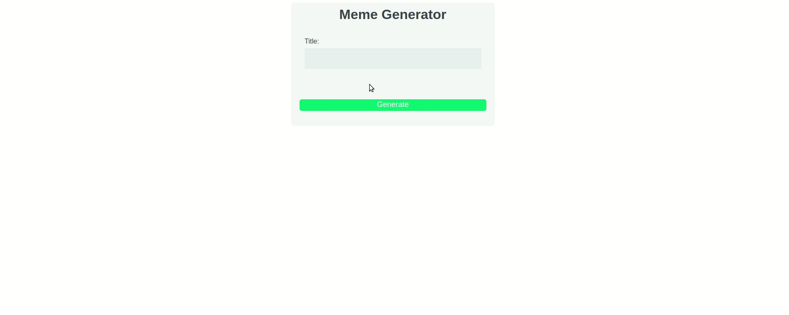

# Meme Generator

Meme Generator allows you to generate memes

## Installation 

Ensure NodeJS is install

Use NPM to install

```bash
npm install
```

## Usage

Run

```bash
node server.js
```
Sample:



Go to the PORT you've set and search for the meme of your choice.

## Contributing
Pull requests are welcome. For major changes, please open an issue first to discuss what you would like to change.

Please make sure to update tests as appropriate.

## License
[MIT](https://choosealicense.com/licenses/mit/)